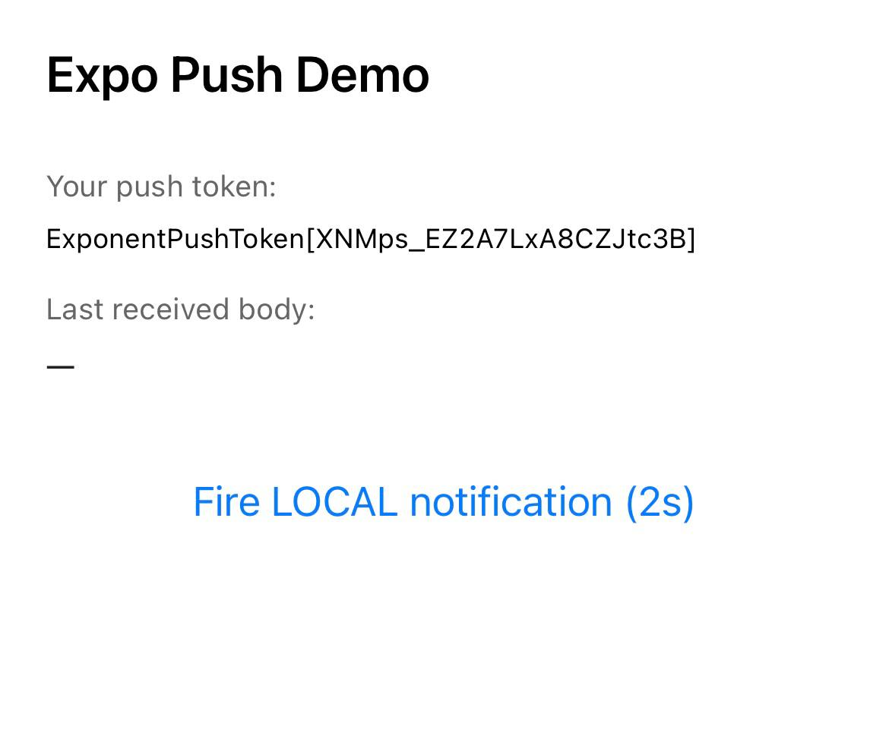
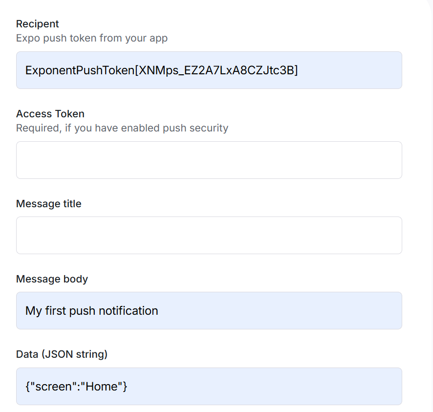
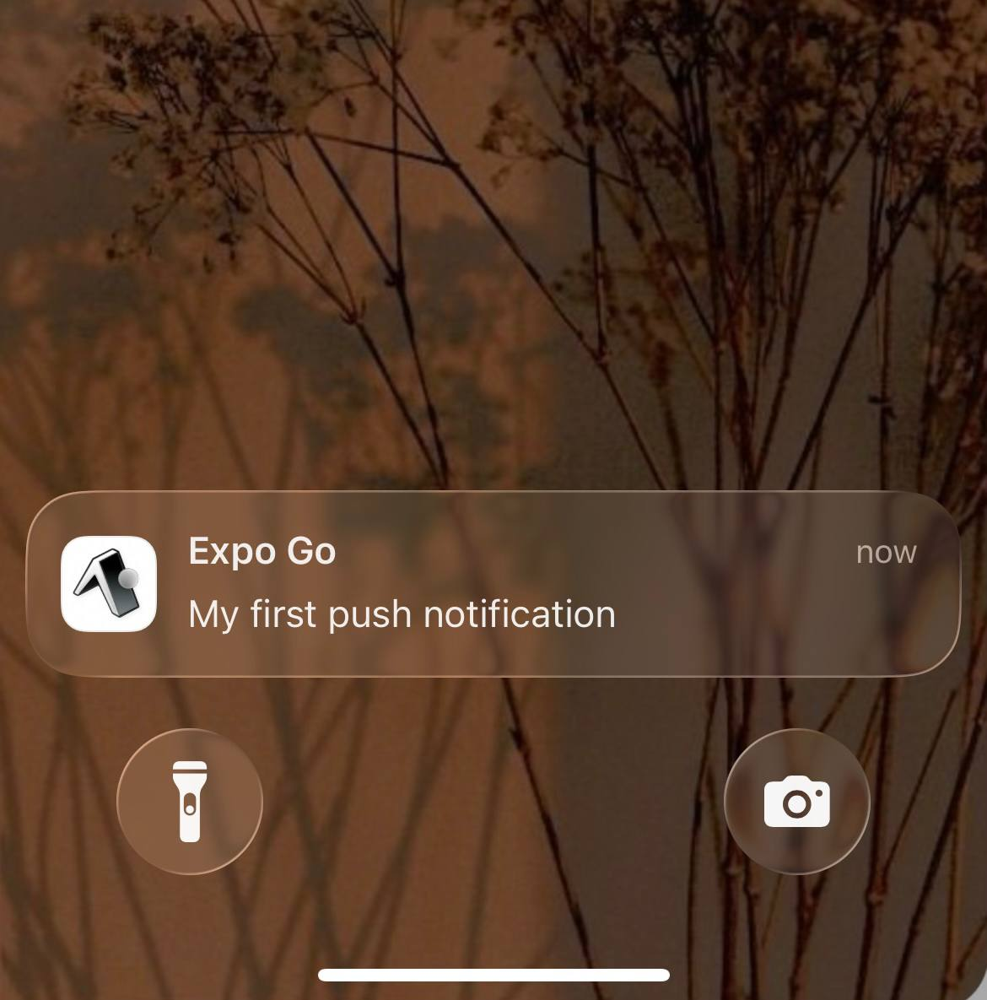
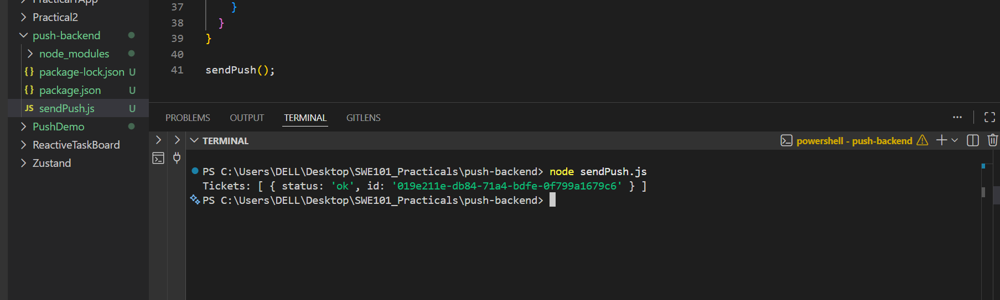

## Push Notification System Using Expo React Native

## Title
- Implementation of Push Notifications using Expo React Native and Node.js Backend

## Aim
- Create a mobile application and backend server that can send and receive push notifications using the services of Expo Notification Services.

## Objective
- Install and set up Expo notification packages.
- Generate Expo push tokens.
- Send and receive push notifications locally and remotely.
- Build a backend server with Node.js for notifications.

## Learning Outcome
- Learn about push notification process flow.
- Set up Expo notifications.
- Develop and test Android builds.
- Trigger notifications using frontend and backend applications.

## Requirements
- Node.js and npm
- Expo CLI and EAS CLI
- VS Code
- Internet connection
- Expo 

## Procedure

### Step1:
- Created Expo project using create-expo-app.

### Step2:
- Verified Node.js and npm installation using node -v and npm -v.
- Installed EAS CLI globally using npm install -g eas-cli.

### Step3: 
- Installed expo-notifications, expo-device, and expo-constants.
- Logged into Expo account using eas login.

### Step4:
- Initialized EAS using eas init.
- Configured app. json with package name and plugins.

### Step5:
- Added push notification code in App.tsx.
- Generated Expo push token.

### Step6:
- Sent test notifications using Expo Notification.

### Step7:
- Created push-backend project using Node.js.
- Installed expo-server-sdk.

### Step8:
- Wrote sendPush.js to send notifications.
- Executed backend server using node sendPush.js.

## Program/Code
- Github Repository: https://github.com/choden12/SWE201_Practical_1/tree/06d55eaeedf633155a4427205475df7aec336d2d/Practical4

### Main Files:
- App.tsx
- SendPush.js

## Output
### 1. PushDemo
- Got push token

#### Send a Test Push from the Browser

#### Then the notification was sended to phone 

 
### 2. Push Backend 
- Returns tickets.

 
## Observation
- I have observed that:
- The local notification function performed well without an internet connection.
- The remote notification function sent the message successfully.
- The backend server was able to connect properly with the Expo server.
- The notification data payload can be accessed within the application.

## Problem Encountered
- It was difficult for me to overcome the challenge that my app could not use remote push notifications due to Expo Go not supporting them with Expo SDK versions 53 and above.
- The issue that I came across was setting up the USB debugging for the Android device before connecting to the computer for testing purposes.
- There were some failures in delivering notifications when using invalid or expired Expo push tokens.

## Conclusion
- The practical was executed effectively, and the React Native mobile application and the Node.js backend server were successful in implementing push notifications through the use of Expo services. The practical provided me with knowledge on how to set up Expo notifications, generate Expo push tokens, create local and remote notifications, and manage the notification response within the application. Additionally, I acquired practical skills on developing the backend service to communicate with Expo servers to enable push notifications to be delivered to mobile phones.

## References
- Sanyasi, S. (2026). Expo notification. HackMD Expo Notification Guide 
- Expo. (2026). Expo push notifications overview. Expo Documentation
- Expo. (2026). Expo push notification tool. Expo Notifications Tool
- Node.js Foundation. (2026). Node.js documentation. Node.js Official Website

